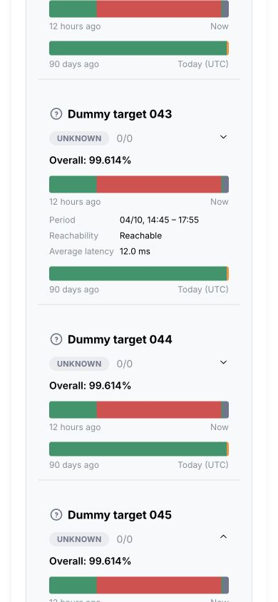

# 整体改造本地验收

2026-10-05。本文只记录本地实现和验收；生产迁移、上线、两台探针升级与旧资源/备份删除尚待 D1 免费读取额度恢复。生产续作见 [refactor-deployment.md](refactor-deployment.md)。

## 实现范围

- 静态页面、API、Cron、区域 RemoteChecker 与 Coordinator 统一为一个 Worker。公开 DTO、紧凑投影和私有配置分离；公开 KV/边缘缓存不依赖访问时读取 D1。
- state-v2 将最新状态与事故、延迟窗口、探针原始块分开；稳定批次回执、短提交租约和原子 D1 batch 保护持久化/ACK/通知一致性。
- 区域批量 RPC 使用共享队列、配置指纹和版本验证；连接和必要正文读取都有截止时间与字节限制。探测系统故障形成采样空缺。
- 低频索引清理、有界公开物化、按目标历史查询、事故分页和持久通知目的地回执。完整语义迁移、回滚、全库恢复与只读归档工具齐备。
- 页面支持 500 目标/33 探针与 1650 分配的配置上限；同时展开最多 3 组，每组一页 10 项。移动端保留合并色带和仅三项的页内详情。
- Go 保持协议 v1、gzip、本地持久队列与遥测，远程配置目标上限与服务端一致调整到 500。

## 验证结果

| 检查 | 本地结果 |
| --- | --- |
| Worker 回归 | 19 文件、188 项通过，包含实际 workerd/D1 绑定 |
| util 回归 | 56 项通过 |
| Python 迁移/备份恢复/归档 | 6 项通过 |
| TypeScript 与 lint | Worker/页面类型检查通过，无 ESLint 警告或错误 |
| 构建 | Next 静态页面与统一 Worker 产物生成成功，Wrangler dry-run 成功 |
| 管理 API | 实际 Worker 产物 70 个 HTTP 断言，另含 D1 与公开隐私检查 |
| 公开缓存 | 实际产物不绑定 D1，522 个检查；摘要可返回，6 个受保护入口均拒绝未鉴权访问 |
| Coordinator/区域 RPC | 真实 DO RPC、200 样本 gzip 接收、重放、状态查询、重建、KV 物化与冲突拒绝通过 |
| 本地启动脚本 | 一个 8795 端口：公开页/管理壳 200、管理 API/管理 Token API 401；D1 落盘，退出码 0 |
| Go | `go test -race ./...` 通过；Linux amd64/arm64、macOS arm64、Windows amd64 构建通过 |

回归使用虚构数据与凭据，没有通过真实 Webhook 通知第三方。普通 Webhook 仍采用至少一次投递：远端已接收而本地回执丢失时可能重试；支持幂等键的接收端可进一步去重。

实际启动验证发现并修复 macOS Bash 3 的空数组/nounset 兼容问题。大负载回归发现并修复无 KV 兼容路径读取单目标历史时额外加载全部目标摘要的问题。受限环境拒绝回环监听导致的测试启动失败，在允许本地 workerd 监听后重跑验收。

## 页面与响应上界

500 目标、3 探针、1500 分配、25 组的虚构数据库包含 216000 个五分钟桶、135000 个日桶和 150000 个旧样本。初始静态 HTML 为 2418 字节、0 条 SQL、0 个图表。无 KV 的兼容摘要 `/api/state` 为 162932 字节，读取当前摘要而不扫描历史；单目标历史为 93140 字节、8 条 SQL、返回 1012 行。非法查询在数据库读取前返回 400。配置全部暂停时仅查询元数据，不扫描历史。

浏览器实际验证：初始折叠 DOM 292 个节点；桌面展开 3 组仅挂载 30 张卡片，打开第 4 组自动收起最早的一组。历史请求最大并发为 2。390×844 视口的页面宽度与滚动宽度均为 390；点击色带后在原页显示时段、可达性、平均延迟，无对话框或新页面。

截图为虚构负载，不能作为生产目标连通性证据：

## D1 资源对比

完整数字见 [refactor-results.json](refactor-results.json)。读写来自 D1 执行元数据，SQL 数包含持久化所需查询；不是以最终存储行数推算计费写入。

| 同一虚构场景 | 旧路径 SQL/读/写 | v2 SQL/读/写 |
| --- | --- | --- |
| 30 个稳定探针样本 | 22 / 1870 / 244 | 33 / 866 / 190 |
| 30 个不可达样本 | 22 / 3258 / 305 | 33 / 1062 / 282 |
| 30 个超时样本 | 22 / 3890 / 335 | 33 / 1032 / 311 |
| 恢复通知 | 22 / 5152 / 245 | 33 / 1002 / 132 |
| 200 个积压样本 | 17 / 67715 / 520 | 26 / 2996 / 134 |
| 25 个稳定 native 目标 | 8 / 383 / 54 | 14 / 765 / 129 |

同一轮旧/v2 使用相同时间戳与负载；不同轮次是否跨过五分钟边界会改变部分历史写入数量，表中保留最终一轮结果。小 native 场景的 v2 SQL、读写和本地墙钟更高，不能宣称所有负载均更快。收益主要是历史增长后读取量有界、积压批量写入、幂等与事务一致性。额外容量检查：200 native 目标 22 条 SQL、读 16433、写 3004；200 探针窗口 25 条 SQL、读 7571、写 2609；500 条无变化通知评估 10 条 SQL、读 8519、写 0。

真实 Coordinator 接收场景分别记录根 Worker 与 DO：首批根路径 2 条 SQL、读 5、写 0、2 次 DO 调用；Coordinator 17 条 SQL、读 2674、写 74。重放 Coordinator 3 条 SQL、读 6、写 0。每次执行的网络预算仍分别约束根和区域，不表示单次可以无限测量全部配置目标。

本地 workerd 无可用 CPU 计时，因此 JSON 中 `cpuMs` 为 null；DO/执行墙钟只作本地参考，不能当作 Cloudflare CPU 或生产费用证明。生产 CPU、目标数据完整迁移、ACK 积压消减与遥测需要上线后单独验收。Docker 镜像本身未构建验收；验证的是镜像所调用的统一构建和本地启动入口。

## 提交与发布

变更按公开隐私边界、统一入口/区域复用、依赖清理、state-v2/事务、迁移工具、页面加载、部署工具及验收文档分阶段提交。原有 Header logo 尺寸改动保留原样并单独提交，避免后续 CI 重建产物恢复旧尺寸。

GitHub 部署作业默认受 `UNIFIED_DEPLOY_APPROVED` 变量约束。迁移完成并核实 storage_versions=2 后才启用生产部署变量，避免默认 v1 发布覆盖 v2。旧 Worker Cron、workers.dev 和预览入口已经停用；旧 Worker/Pages 尚未删除。
